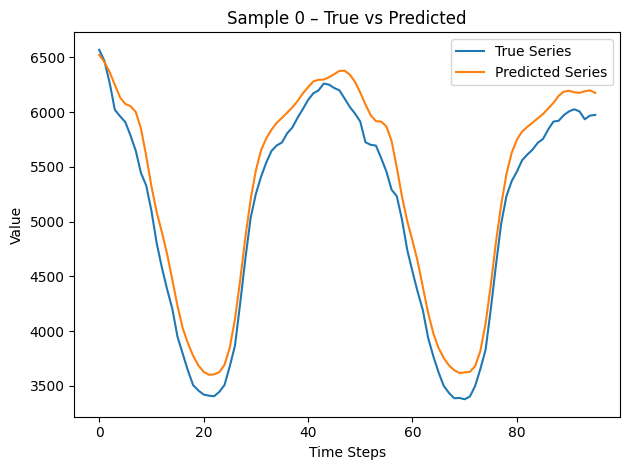
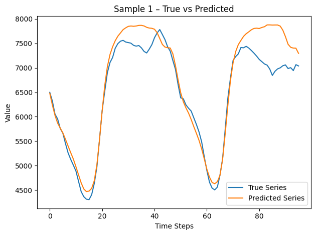

# Very smol PatchTST and lightweight HNSW

### Overview
This project trains a lightweight PatchTST model in 10 hours for a univariate time-series—the **Australian electricity demand** series. We preprocess the series into fixed-length windows, split train/test **before** training to avoid leakage, train a Transformer-based patch model to predict future windows, then index the train embeddings in an HNSW index. We will then compare brute force KNN to HNSW using the test embeddings as queries on our HNSW index of train embeddings.

---

### Experiments

1. **Data Preparation**  
   - Loaded univariate series from the `australian_electricity_demand` dataset.  
   - Created sliding windows of length 96 for “past” context and 24 for “future” targets.  
   - Split chronologically: Randomly split test into train and test.

2. **Baseline Training**  
   - **Model**: PatchTST-small (8 heads, 2 layers, patch length 16)  
   - **Optimizer**: AdamW, learning rate = 2 × 10⁻⁴  
   - **Schedule**: 10 epochs, batch size = 128  

3. **HNSW Indexing & Search**  
   - **Embeddings**: Extracted 128-dim patch embeddings from the trained model for each window.  
   - **Index**: hnswlib L2 space, `M=16`, `ef_construction=200`.  
   - **Query**: set `ef=50`, retrieved top-k neighbors (`k=5`) for each test embedding.

---

### Results

- **Forecasting (PatchTST)**  
  - Test RMSE: 209.9130    
  Graphs showing prediction versus actual value:     

- **HNSW Vector Search**  
Highly recommend reading notebook summary of how HNSW work if you are not familiar.  
HNSW index with all of our training data, we search our test data converted to embeddings and compare KNN to HNSW performance.
  - **Recall@5** (percentage of true nearest neighbors in top-5): 100%
  - **Average query latency**: Brute-force total time: 0.3219s (0.003219s/query)     
                               HNSW total time: 0.0435s (0.000435s/query)     
                               Mean recall for all 5: 100.00%    
                               Speedup: approx. 7.4 × faster with HNSW    

These results show that the patch embeddings capture meaningful temporal patterns and that HNSW can retrieve similar contexts with high recall and low latency. We should note that HNSW requires us to store the full index in memory for search, this means as embeddings scale our memory size will increase signficantly. We could leverage sharding to work around this issue, with potential to optimize sharding strategy based on use case.

### Roadmap & Experiment Tracker

- **RAG over time‑series** _(Attempted)_ 
  - **Hypothesis:** Text‑prompt retrieval for time series can enhance interpretability and retrieval accuracy.  
  - **Proposed Solution:** Fine‑tune CLIP contrastively using filenames as text tokens, tag each series by domain, and treat out‑of‑domain series as negatives.  
  - **Result:** Need a LMM trained on constrastive loss between patches from PatchTST architecture, and other modalities of time series data.   

- **Masked self‑supervision** _(Attempted)_  
  - **Hypothesis:** Pre‑training with masked patches yields better representations and reduces labeled‑data requirements.  
  - **Proposed Solution:** Train `PatchTSTModel` (`do_mask_input=True`) for 1 epoch on each GiftEvalPretrain split, masking 20% of inputs.  
  - **Result:** Attempted on Google Colab Pro but ran into timeouts and GPU‑resource limits—pretraining did not complete.
 
- **Compute power & Heavier Model** _(Attempted)_  
  - **Hypothesis:** Longer training schedules, larger batches, wider embeddings, and longer patch/stride lengths will let PatchTST converge to deeper minima and capture long‑term dependencies.  
  - **Proposed Solution:** Plan a 100‑epoch run on T4 GPUs with mixed precision; adjust model width and patch parameters.  
  - **Result:** Attempted on Google Colab Pro but ran into timeouts and GPU‑resource limits—pretraining did not complete.  

- **More training data** _(Completed)_  
  - **Hypothesis:** A broader corpus (weather, stocks, etc.) provides richer temporal priors and lowers variance.  
  - **Proposed Solution:** Stream and merge additional GiftEval splits using the Hugging Face Datasets API, loading feature metadata on the fly.  
  - **Result:** Successfully loaded a variety of GiftEval dataset via streaming, enabling full‑scale experiments.  

- **HNSW tuning**  
  - **Hypothesis:** Index hyperparameters affect recall vs. latency trade‑offs as the corpus grows.  
  - **Proposed Solution:** Grid‑search `M ∈ {16, 32}` and `ef_construction ∈ {100, 200, 400}` on a corpus of >100 k embeddings.  

- **Frequency‑Aware Parameterization**  
  - **Hypothesis:** Tailoring window lengths and scaling factors based on data frequency (daily, weekly, monthly) improves model performance across varied time scales.  
  - **Proposed Solution:** Parameterize the temporal window and normalization scheme according to each dataset’s sampling frequency.  
