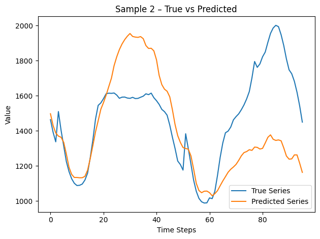

# Very smol PatchTST and lightweight HNSW

### Overview
This project trains a lightweight PatchTST model in 10 hours for a univariate time-series—the **Australian electricity demand** series. We preprocess the series into fixed-length windows, split train/test **before** training to avoid leakage, train a Transformer-based patch model to predict future windows, then index the train embeddings in an HNSW index. We will then compare brute force KNN to HNSW using the test embeddings as queries on our HNSW index of train embeddings.

---

### Experiments

1. **Data Preparation**  
   - Loaded univariate series from the `australian_electricity_demand` dataset.  
   - Created sliding windows of length 96 for “past” context and 24 for “future” targets.  
   - Split chronologically: Randomly split test into train and test.

2. **Baseline Training**  
   - **Model**: PatchTST-small (8 heads, 2 layers, patch length 16)  
   - **Optimizer**: AdamW, learning rate = 2 × 10⁻⁴  
   - **Schedule**: 10 epochs, batch size = 128  

3. **HNSW Indexing & Search**  
   - **Embeddings**: Extracted 128-dim patch embeddings from the trained model for each window.  
   - **Index**: hnswlib L2 space, `M=16`, `ef_construction=200`.  
   - **Query**: set `ef=50`, retrieved top-k neighbors (`k=5`) for each test embedding.

---

### Results

- **Forecasting (PatchTST)**  
  - Test RMSE: 209.9130    
  Graphs showing prediction versus actual value:     

- **HNSW Vector Search**  
Highly recommend reading notebook summary of how HNSW work if you are not familiar.  
HNSW index with all of our training data, we search our test data converted to embeddings and compare KNN to HNSW performance.
  - **Recall@5** (percentage of true nearest neighbors in top-5): 100%
  - **Average query latency**: Brute-force total time: 0.3219s (0.003219s/query)     
                               HNSW total time: 0.0435s (0.000435s/query)     
                               Mean recall for all 5: 100.00%    
                               Speedup: approx. 7.4 × faster with HNSW    

These results show that the patch embeddings capture meaningful temporal patterns and that HNSW can retrieve similar contexts with high recall and low latency. We should note that HNSW requires us to store the full index in memory for search, this means as embeddings scale our memory size will increase signficantly. We could leverage sharding to work around this issue, with potential to optimize sharding strategy based on use case.

---

### Areas for Improvement

- **More Training Data**  
  Incorporate additional univariate series (e.g., weather, stock prices) or multivariate extensions to improve robustness across domains.
- **Compute Power**  
  Training for 50–100 epochs with larger batches on GPUs/TPUs may further reduce forecasting loss.
- **Model Capacity**  
  Using heavier PatchTST (more layers, higher `d_model`) could capture longer-range dependencies—at the cost of compute.
- **HNSW Tuning**  
  Experiment with `M` and `ef_construction` to trade off index build time, memory, and query recall/latency with much more data, evaluate use of RAG with HNSW pipeline provided contextual time series data for a specific problem.

---

### Future Work

1. **Transfer Learning**  
   - Pretrain on a large corpus of diverse time-series and fine-tune to target domains for few-shot forecasting. We need to develop a better understanding of how to streamline the full GiftEval datasets into training a model at once. Consideration of the different frequencies across datasets (e.g., daily, weekly, monthly) and parametezing the window length and scaling factor based kn frequency given will make this training process conical.  
2. **Alternative Forecasting Paradigms**  
   - Our Jupyter Notebook forecasts tend to smooth over small peaks and valleys. To recover these fine-grained fluctuations in a lightweight model, we propose adding a reverse-diffusion module that injects controlled noise back into the predictions.
3. **Leverage RAG**
   - We propose applying RAG (HNSW) with a user prompting for a time series based on particular meta data. Thought is still being put into
how we can organize the data within the DB to link word embedding to a set of data that would seed the PatchTST to forecast. Intial thoughts may be we customize indexing of HNSW to associate word embeddings as entry nodes, and then store our time series emebddingd under that entry point. This would be highly domain specific.   
4. **Self-supervised**
   - Use Hugging Faces Masked PatchTST and compare results to current model

---